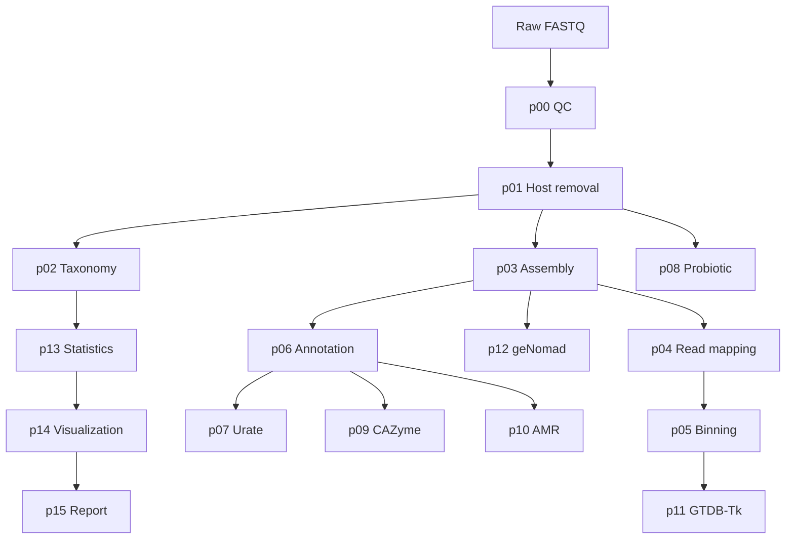

# Nanopore Long-read Metagenome Pipeline v1.0

A modular Python workflow for Oxford Nanopore long-read shotgun metagenomics.

## Project purpose

This project supports:

- read quality control
- host-read removal
- taxonomic profiling
- long-read metagenome assembly
- read-to-contig remapping
- MAG binning and quality assessment
- contig annotation
- urate-pathway gene detection
- probiotic detection
- CAZyme annotation
- AMR screening
- GTDB-Tk taxonomy
- plasmid and virus detection
- study-level matrices, visualization, and HTML reporting

## Pipeline



## Project structure

```text
pipeline/
├── p00_qc.py
├── p01_host_removal.py
├── p02_taxonomy.py
├── p03_assembly.py
├── p04_read_mapping.py
├── p05_binning.py
├── p06_annotation.py
├── p07_urate.py
├── p08_probiotic.py
├── p09_cazyme.py
├── p10_amr.py
├── p11_gtdbtk.py
├── p12_genomad.py
├── p13_statistics.py
├── p14_visualization.py
└── p15_report.py
```

## samples.tsv

Tab-separated format:

```tsv
sample_id	subject_id	diet	age_months	timepoint	batch	fastq
S001	P001	control	6	T0	B1	/path/to/S001.fastq.gz
S002	P001	intervention	9	T1	B1	/path/to/S002.fastq.gz
```

| Column | Meaning |
|---|---|
| sample_id | Unique sequencing-sample ID |
| subject_id | Subject ID for repeated samples |
| diet | Diet or intervention arm |
| age_months | Age at sampling |
| timepoint | Sampling time point |
| batch | Extraction/library/sequencing batch |
| fastq | FASTQ or FASTQ.GZ path |

## Commands

Install Python requirements:

```bash
python -m pip install -r requirements.txt
```

List steps:

```bash
python run.py list-steps
```

Validate paths:

```bash
python run.py validate
```

Dry run:

```bash
python run.py run --dry-run
```

Run everything:

```bash
python run.py run
```

Run selected steps:

```bash
python run.py run --steps qc,host_removal,taxonomy
```

Run selected samples:

```bash
python run.py run --samples S001,S002
```

Force rerun:

```bash
python run.py run --samples S001 --steps assembly,read_mapping --force
```

## Important notes

- External command-line tools must be installed separately.
- Bracken output should be validated for long-read data.
- `bins_combined` is not a final bin-refinement strategy.
- Probiotic presence and disease-gene presence in the same sample do not prove linkage.
- Use negative controls, product controls, and spike-in samples to define detection thresholds.
